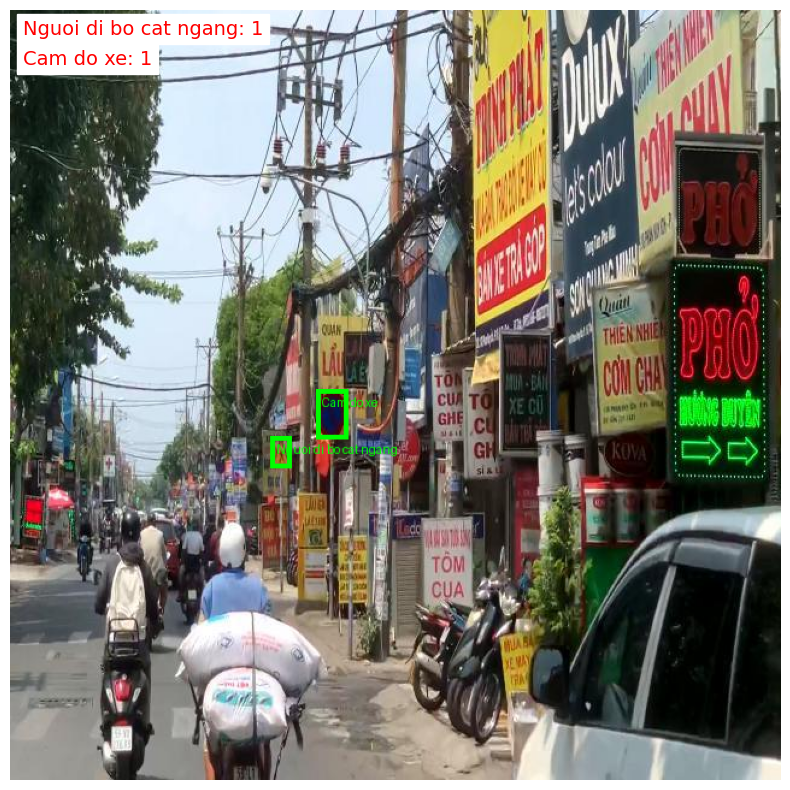
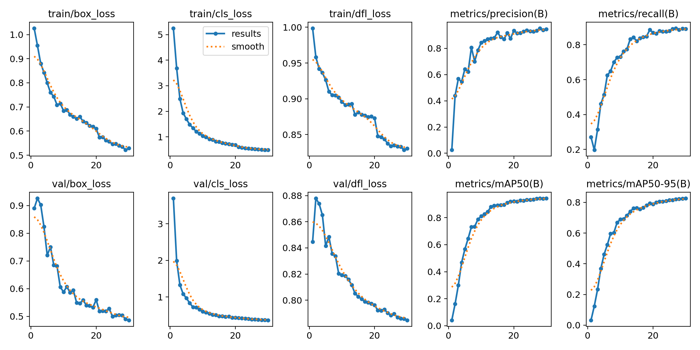
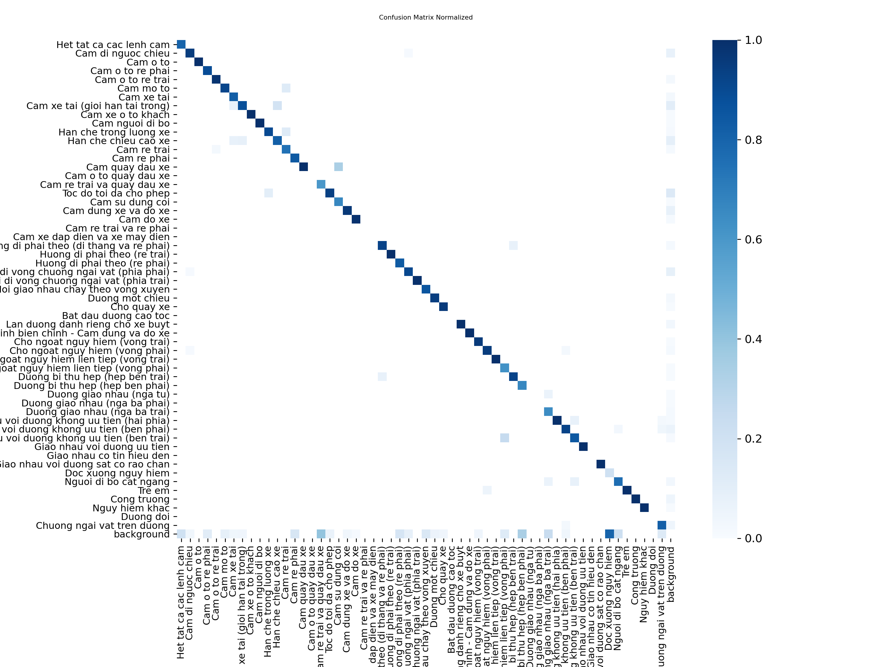

# 🚦 Vietnamese Traffic Sign Detection — YOLOv11


Phát hiện **56 loại biển báo giao thông Việt Nam** theo chuẩn QCVN 41:2019/BGTVT sử dụng mô hình **YOLOv11n**, huấn luyện trên Kaggle GPU T4 x2 với dataset public từ Roboflow.

---

## 📸 Demo

<!-- Thêm ảnh predict mẫu sau khi có kết quả -->


---

## 📊 Kết quả mô hình

| Metric | Tập Val | Tập Test |
|--------|---------|----------|
| mAP@50 |  | 0.82627 | 0.9573 |
| mAP@50-95 | 0.94293 | 0.8368 |
| Precision | 0.94666 | 0.9373 |
| Recall | 0.89003 | 0.8822 |

> Cập nhật sau khi huấn luyện xong — xem thêm tại [Kaggle Notebook](https://www.kaggle.com/code/bacnguyen2003/bi-n-b-o-giao-th-ng)

---

## 📁 Cấu trúc dự án

```
vietnamese-traffic-sign-yolo11/
├── notebooks/
│   └── bien-bao-giao-thong-viet-nam.ipynb   # Pipeline đầy đủ: EDA → train → eval → inference
├── configs/
│   └── dataset.yaml                          # Cấu hình 56 class biển báo
├── scripts/
│   ├── export_onnx.py                        # Export sang ONNX
│   └── inference_video.py                    # Inference trên video
├── results/                                  # Confusion matrix, PR curve, training curves
├── weights/                                  # best.pt (Git LFS)
├── requirements.txt
└── README.md
```

---

## 📦 Dataset

| | |
|---|---|
| **Nguồn** | Roboflow → Kaggle |
| **Link** | [bien-bao-giao-thong-viet-nam](https://www.kaggle.com/datasets/bacnguyen2003/bien-bao-giao-thong-viet-nam) |
| **Số class** | 56 loại biển báo |
| **Chuẩn** | QCVN 41:2019/BGTVT |
| **Format** | YOLOv8/v11 (YOLO txt labels) |

### Phân loại biển báo

| Nhóm | Ký hiệu | Số lượng |
|------|---------|----------|
| Biển cấm | P-xxx | 22 loại |
| Biển hiệu lệnh | R-xxx | 9 loại |
| Biển nguy hiểm | W-xxx | 22 loại |
| Biển hết lệnh cấm | DP-xxx | 1 loại |
| Biển phụ | S-xxx | 1 loại |
| **Tổng** | | **56 loại** |

---

## 🚀 Kaggle Notebook

Toàn bộ pipeline 9 bước chạy trên Kaggle GPU T4 x2:

| Bước | Nội dung |
|------|---------|
| 1 | Kiểm tra môi trường & GPU |
| 2 | Cài đặt thư viện (Ultralytics) |
| 3 | Cấu hình tham số huấn luyện |
| 4 | Ánh xạ tên class sang tiếng Việt |
| 5 | Khám phá dataset (EDA) |
| 6 | Huấn luyện YOLOv11n |
| 7 | Theo dõi training curves |
| 8 | Đánh giá trên tập test |
| 9 | Inference ảnh & video, export TensorRT |

🔗 [Xem notebook trên Kaggle](https://www.kaggle.com/code/bacnguyen2003/bi-n-b-o-giao-th-ng) 

---

## 🖥️ Chạy Demo local

```bash
# Clone repo
git clone https://github.com/Namvipcf/vietnamese-traffic-sign-yolo11.git
cd vietnamese-traffic-sign-yolo11

# Cài thư viện
pip install -r requirements.txt

# Chạy Gradio app
python app.py
```

Mở trình duyệt tại `http://localhost:7860` — giao diện hỗ trợ:
- **Tab Ảnh** — upload nhiều ảnh cùng lúc, xem bounding box + bảng tổng hợp
- **Tab Video** — upload video, xuất video đã gắn nhãn
- **Slider confidence** — điều chỉnh ngưỡng phát hiện (mặc định 0.5)

> `best.pt` phải nằm cùng thư mục với `app.py`

---

## ⚙️ Tham số huấn luyện

| Tham số | Giá trị |
|---------|---------|
| Model | `yolo11n.pt` |
| Epochs | 30 |
| Image size | 640 × 640 |
| Batch size | 64 |
| Device | GPU T4 × 2 |
| Patience | 10 (early stopping) |
| Augmentation | HSV, translate, scale, mosaic, flip |

---

## 🛠️ Cài đặt & chạy local

```bash
# Clone repo
git clone https://github.com/Namvipcf/vietnamese-traffic-sign-yolo11.git
cd vietnamese-traffic-sign-yolo11

# Cài thư viện
pip install -r requirements.txt
```

**Inference ảnh:**
```python
from ultralytics import YOLO

model = YOLO("weights/best.pt")
results = model.predict("anh_bien_bao.jpg", conf=0.5)
results[0].show()
```

**Inference video:**
```bash
python scripts/inference_video.py --source video.mp4 --weights weights/best.pt
```

---

## 📈 Kết quả trực quan

| Training Curves | Confusion Matrix |
|:---:|:---:|
|  |  |

---

## 🗂️ Môi trường huấn luyện

| | |
|---|---|
| Platform | Kaggle Notebooks |
| GPU | NVIDIA Tesla T4 × 2 |
| VRAM | 16 GB × 2 |
| Framework | Ultralytics YOLOv11 |
| Export | ONNX, TensorRT (FP16) |

---

## 📄 License

MIT License — xem [LICENSE](LICENSE)

---

## 👤 Tác giả

**[Tên của bạn]**
- GitHub: [@your_username](https://github.com/Namvipcf)
- Kaggle: [@your_kaggle](https://www.kaggle.com/bacnguyen2003)
